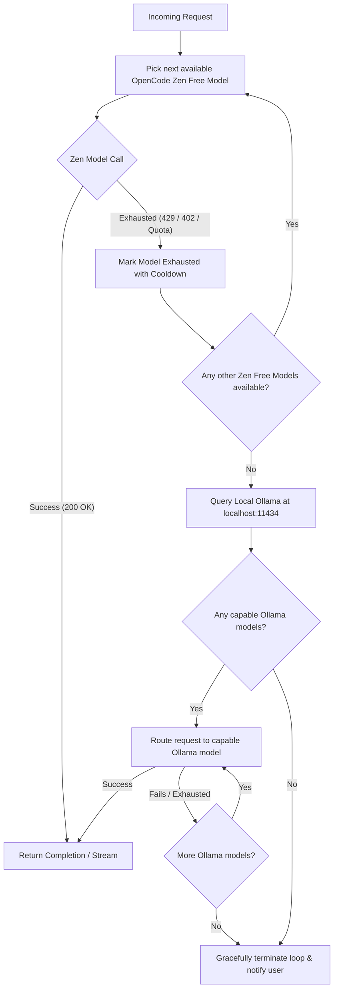

# RoundRobin 🔀

**RoundRobin** is a free-model LLM router and CLI tool. It intelligently routes your requests across **OpenCode Zen verified free models**, automatically rotating to the next free model when usage limits or rate limits are reached. When all free cloud models are exhausted, it routes back to check for **local Ollama** models. If none are responsive, it gracefully terminates the loop and provides a clear notice.

> 📚 Verified OpenCode Zen models reference: [https://opencode.ai/docs/zen/](https://opencode.ai/docs/zen/)

---

## ✨ Features

- 🆓 **Exclusively Verified Free Models**: Routes strictly through models verified as **Free** on OpenCode Zen:
  1. `big-pickle` (Big Pickle)
  2. `mimo-v2.5-free` (MiMo-V2.5 Free)
  3. `ling-3.0-flash-fin-free` (Ling 3.0 Flash Fin Free)
  4. `nemotron-3-ultra-free` (Nemotron 3 Ultra Free)
  5. `nemotron-3.5-lightning-free` (Nemotron 3.5 Lightning Free)
  6. `muse-spark-1.2-contributor-free` (Muse Spark 1.2 Contributor Free)
- 🔄 **Automatic Exhaustion Rotation**: Detects HTTP `429 Too Many Requests`, `402 Quota Exceeded`, `503 Overloaded`, or token/rate exhaustion error messages and automatically transfers the request to the next available free model.
- 🦙 **Smart Ollama Fallback**: When all OpenCode Zen verified free models are exhausted, it probes local Ollama (`http://localhost:11434`), discovers capable models (e.g. `qwen3`, `llama3.2`, `deepseek-r1`, `qwen2.5-coder`), and routes requests locally.
- 🛑 **Graceful Loop Termination**: If all Zen free models are exhausted and no responsive Ollama models are found, it gracefully exits the loop without crashing or hanging, letting the user know exactly what happened.
- ⚡ **OpenAI-Compatible Proxy Server**: Run `roundrobin serve` and point **Cursor**, **OpenCode**, **Aider**, **Continue**, or any OpenAI SDK to `http://localhost:8080/v1`.
- 🌊 **Real-Time Streaming**: Full SSE (Server-Sent Events) streaming support for both CLI and API server.
- 📦 **Dual API & CLI**: Use as a global command-line tool or import directly into your TypeScript/Node.js project as an SDK.

---

## 🚀 Installation

### Global CLI
```bash
# Install globally via npm
npm install -g roundrobin

# Or run directly with npx
npx roundrobin
```

### In Your Project
```bash
npm install roundrobin
```

---

## 🔑 Setup OpenCode Zen Key

OpenCode Zen requires a free API key to access its verified models. Obtain your key from [OpenCode Zen](https://opencode.ai/docs/zen/).

You can configure the key in any of the following ways:

```bash
# Option 1: CLI configuration (persisted to ~/.roundrobin/config.json)
roundrobin config set-key YOUR_OPENCODE_ZEN_KEY

# Option 2: Environment variable
export OPENCODE_ZEN_API_KEY="your-api-key"
# or
export OPENCODE_API_KEY="your-api-key"

# Option 3: In a .env or .roundrobinrc file in your project
OPENCODE_ZEN_API_KEY=your-api-key
```

---

## 💻 CLI Usage

### 1. Interactive Chat
Start an interactive chat session with live model indicators and automatic rotation:

```bash
roundrobin
# or
roundrobin chat
```

Special interactive commands:
- `/models` — View current status and cooldowns of all models
- `/reset`  — Reset all model cooldowns immediately
- `exit`    — Quit chat

### 2. Single-Shot Prompt (Streaming)
Pipe or stream single prompts directly in your terminal:

```bash
roundrobin prompt "Explain quicksort in TypeScript with examples"
```

### 3. OpenAI-Compatible Proxy Server
Start a local proxy server that intercepts OpenAI-formatted requests, automatically rotating free models behind the scenes:

```bash
roundrobin serve --port 8080
```

Now configure your favorite editor or tool:
- **Base URL**: `http://localhost:8080/v1`
- **API Key**: any string (e.g. `roundrobin`)
- **Model**: `roundrobin` (or any model name)

Endpoints exposed:
- `POST /v1/chat/completions` (JSON & SSE streaming)
- `GET /v1/models`
- `GET /status` (Live rotation metrics & cooldowns)
- `GET /health`

### 4. Inspect Model Status & Cooldowns
Check the availability of OpenCode Zen free models and your local Ollama models:

```bash
roundrobin models
```

Output:
```
OpenCode Zen Verified Free Models:
────────────────────────────────────────────────────────────────────────────────
 Model ID                         Name                           Status
────────────────────────────────────────────────────────────────────────────────
 big-pickle                       Big Pickle                     ● Available (Free)
 mimo-v2.5-free                   MiMo-V2.5 Free                 ● Available (Free)
 ling-3.0-flash-fin-free          Ling 3.0 Flash Fin Free        ● Available (Free)
 nemotron-3-ultra-free            Nemotron 3 Ultra Free          ● Available (Free)
 nemotron-3.5-lightning-free      Nemotron 3.5 Lightning Free    ● Available (Free)
 muse-spark-1.2-contributor-free  Muse Spark 1.2 Contributor Free ● Available (Free)
────────────────────────────────────────────────────────────────────────────────

Local Ollama Fallback Models (http://localhost:11434):
────────────────────────────────────────────────────────────────────────────────
 qwen3:0.6b                       Local model qwen3 (751.63M)
 llama3.2:3b                      Local model llama (3.2B)
 deepseek-r1:7b                   Local model qwen2 (7.6B)
────────────────────────────────────────────────────────────────────────────────
```

### 5. Diagnose & Test Connections
Test your connections to OpenCode Zen and Ollama:

```bash
roundrobin test
```

---

## 🛠️ TypeScript / JavaScript SDK

You can use RoundRobin programmatically in your applications:

```typescript
import { RoundRobin, createRoundRobin } from 'roundrobin';

const rr = new RoundRobin({
  openCodeZenApiKey: process.env.OPENCODE_ZEN_API_KEY,
  ollamaHost: 'http://localhost:11434', // optional, defaults to http://localhost:11434
  cooldownMs: 60_000,                  // 60 seconds cooldown when rate-limited
});

// Listen to rotation lifecycle events
rr.on('model-rotated', (fromModel, toModel, reason) => {
  console.log(`Rotated from ${fromModel} to ${toModel}: ${reason.message}`);
});

rr.on('ollama-fallback', (availableModels) => {
  console.log(`All Zen models exhausted! Falling back to Ollama:`, availableModels);
});

rr.on('all-exhausted', (summary) => {
  console.warn(`Gracefully stopped:`, summary.message);
});

// Non-streaming chat
const response = await rr.chat('Write a binary search function in Python');
console.log(response.choices[0].message.content);
console.log('Handled by:', response._roundRobin?.routedModel);

// Streaming chat
for await (const chunk of rr.streamChat('Give me 3 startup ideas')) {
  process.stdout.write(chunk.choices[0]?.delta?.content || '');
}
```

### Advanced Options

```typescript
import { RoundRobinRouter } from 'roundrobin';

const router = new RoundRobinRouter({
  openCodeZenApiKey: 'your-key',
  cooldownMs: 120_000,          // 2 minute cooldown on 429s
  autoCooldownReset: true,      // Automatically restore models once cooldown expires
  persistState: true,           // Persist cooldown state to disk across CLI runs
  requestTimeoutMs: 45_000,     // 45s request timeout
});
```

---

## ⚙️ How the Rotation & Fallback Works



1. **Round-Robin Cycling**: Requests cycle sequentially through verified free models (`big-pickle`, `mimo-v2.5-free`, `ling-3.0-flash-fin-free`, etc.).
2. **Exhaustion Detection**: When an API call fails with status code 429, 402, or specific quota messages, that model enters a cooldown period (default: 60s).
3. **Immediate Failover**: The prompt is automatically sent to the next available model without losing request context.
4. **Ollama Inspection**: When all 6 verified free models are in cooldown, RoundRobin routes back and checks `http://localhost:11434/api/tags` for capable local models.
5. **Graceful Termination**: If neither Zen free models nor Ollama models are able to respond, RoundRobin cleanly ends the loop and outputs a helpful, user-friendly notice rather than hanging or crashing.

---

## 🧪 Testing

Run the test suite with Vitest:

```bash
npm test
```

All 20+ unit and integration tests verify:
- Accurate OpenCode Zen verified free model list
- Exhaustion detection on status codes (429, 402, 503) and body messages
- Retry-After header parsing
- RoundRobin rotation and events
- Fallback to Ollama
- Graceful termination when all models are exhausted
- OpenAI-compatible HTTP server endpoints & SSE streaming

---

## 📄 License

MIT © [RoundRobin Contributors](LICENSE)
