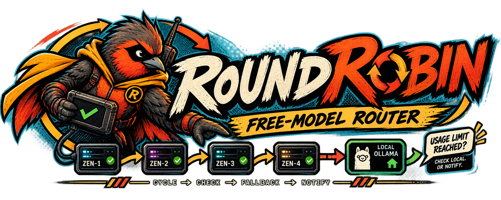
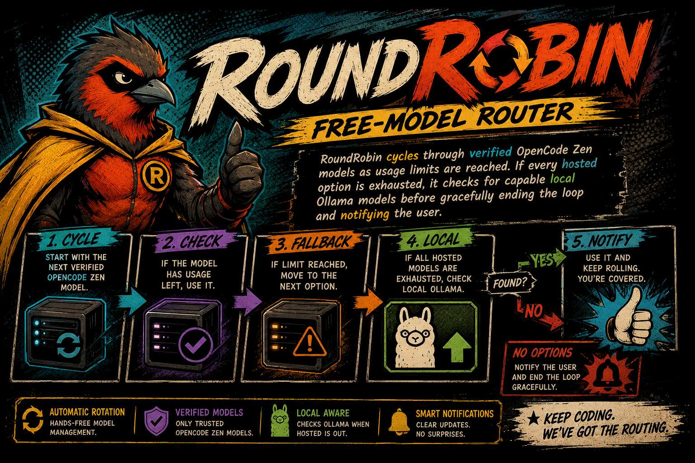

# RoundRobin

<p align="center">
   </img>
</p>

[](https://www.npmjs.com/package/@genoventures-labs/roundrobin)
[](LICENSE)
[](https://nodejs.org)
[](https://vercel.com/docs/ai-gateway)

RoundRobin is a model router and CLI that cycles through **free** language models on [Vercel AI Gateway](https://vercel.com/docs/ai-gateway). When a model hits rate limits or quota errors, RoundRobin rotates to the next free model. If all free Gateway models are exhausted, it falls back to local Ollama. If AI Gateway is unavailable (Pro membership required), free cloud models are treated as unavailable.

---

## Supported Free Models

RoundRobin only routes through AI Gateway language models tagged `free` with $0 input/output pricing. Curated fallbacks:

| Model Identifier | Model Name | Endpoint | Tier |
| :--- | :--- | :--- | :--- |
| `inclusionai/ling-3.0-flash-fin-free` | Ling 3.0 Flash Fin (Free) | AI Gateway v1 | Free |
| `inclusionai/ling-3.0-flash-sante-free` | Ling 3.0 Flash Sante (Free) | AI Gateway v1 | Free |
| `poolside/laguna-s-2.1-free` | Laguna S 2.1 Free | AI Gateway v1 | Free |

At runtime RoundRobin refreshes this list from `https://ai-gateway.vercel.sh/v1/models` and prefers explicit `*-free` ids.

Browse the live catalog: [AI Gateway models](https://vercel.com/ai-gateway/models)

---

## Requirements

1. **Vercel CLI login** — `vercel login` (RoundRobin probes your CLI session for AI Gateway access)
2. **AI Gateway / Pro** — without AI Gateway (Pro), free Gateway models are not available
3. **API key** — `AI_GATEWAY_API_KEY` (create with `vercel ai-gateway api-keys create`)
4. Optional: local [Ollama](https://ollama.com) for offline fallback

---

<p align="center">
   </img>
</p>

## Installation

```bash
npm install -g @genoventures-labs/roundrobin
```

Or:

```bash
npx @genoventures-labs/roundrobin
```

Programmatic:

```bash
npm install @genoventures-labs/roundrobin
```

---

## Configuration

Authenticate with Vercel CLI, then create/set an AI Gateway key:

```bash
vercel login
vercel ai-gateway api-keys create --name roundrobin
export AI_GATEWAY_API_KEY="your_key_here"
# or
roundrobin config set-key YOUR_API_KEY
```

Also supported: `VERCEL_OIDC_TOKEN` from `vercel env pull .env.local`.

Ollama defaults to `http://localhost:11434`:

```bash
roundrobin config set-ollama http://localhost:11434
```

---

## Command-Line Usage

### Interactive Chat

```bash
roundrobin
# or
roundrobin chat
```

Session commands: `/models`, `/reset`, `exit`

### Single-Shot Prompt

```bash
roundrobin prompt "Provide a standard implementation of binary search in TypeScript."
```

### Local API Proxy Server

```bash
roundrobin serve --port 8080
```

- **Base URL**: `http://localhost:8080/v1`
- **API Key**: `roundrobin` (any non-empty string)
- **Model**: `roundrobin` (any identifier; routing is automatic)

Endpoints: `POST /v1/chat/completions`, `GET /v1/models`, `GET /status`, `GET /health`

### Inspect Models / Diagnostics

```bash
roundrobin models
roundrobin test
```

`roundrobin test` checks Vercel CLI login, AI Gateway availability, and Ollama.

---

## SDK Usage

```typescript
import { RoundRobin } from '@genoventures-labs/roundrobin';

const client = new RoundRobin({
  aiGatewayApiKey: process.env.AI_GATEWAY_API_KEY,
  ollamaHost: 'http://localhost:11434',
});

const response = await client.chat('Explain quicksort briefly.');
console.log(response.choices[0].message.content);

for await (const chunk of client.streamChat('List three deployment strategies.')) {
  process.stdout.write(chunk.choices[0]?.delta?.content || '');
}
```

### Event Listeners

```typescript
client.on('model-rotated', (fromModel, toModel, reason) => {
  console.log(`Model rotated: ${fromModel} -> ${toModel} (${reason.message})`);
});

client.on('gateway-unavailable', (reason) => {
  console.warn(reason);
});

client.on('ollama-fallback', (models) => {
  console.log(`Gateway free models unavailable. Fallback to Ollama:`, models);
});

client.on('all-exhausted', (summary) => {
  console.warn(`Routing stopped:`, summary.message);
});
```

---

## How Routing Operates

1. **Pro / AI Gateway check** — uses your Vercel CLI login to verify AI Gateway. If unavailable, free cloud models are empty.
2. **Free catalog** — loads `$0` / `free`-tagged language models from AI Gateway (with curated fallbacks).
3. **Round-robin** — dispatches across free Gateway models; 429/402/exhaustion marks a cooldown and rotates.
4. **Ollama fallback** — if all free Gateway models fail, tries local capable Ollama models.
5. **Clean exit** — if nothing remains, stops with a clear diagnostic (no hang).

---

## License

MIT (c) RoundRobin Contributors. See [LICENSE](LICENSE) for details.
